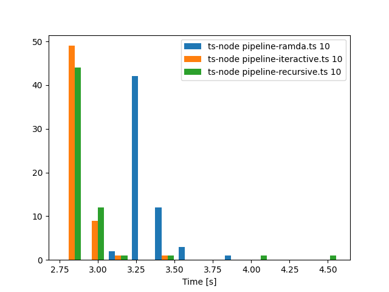

| Command                             |      Mean [s] | Min [s] | Max [s] |    Relative |
| :---------------------------------- | ------------: | ------: | ------: | ----------: |
| `ts-node pipeline-ramda.ts 10`      | 3.379 ± 0.071 |   3.243 |   3.472 | 1.18 ± 0.03 |
| `ts-node pipeline-iteractive.ts 10` | 2.871 ± 0.052 |   2.811 |   2.980 |        1.00 |
| `ts-node pipeline-recursive.ts 10`  | 2.875 ± 0.036 |   2.816 |   2.916 | 1.00 ± 0.02 |

## Summary

`ts-node pipeline-iteractive.ts 10` ran

1.02 ± 0.11 times faster than `ts-node pipeline-recursive.ts 10`

1.16 ± 0.05 times faster than `ts-node pipeline-ramda.ts 10`

## Advanced Statistics

```
Command 'ts-node pipeline-ramda.ts 10'
  runs:         60
  mean:      3.332 s
  stddev:    0.107 s
  median:    3.318 s
  min:       3.193 s
  max:       3.895 s

  percentiles:
     P_05 .. P_95:    3.215 s .. 3.529 s
     P_25 .. P_75:    3.267 s .. 3.361 s  (IQR = 0.094 s)

Command 'ts-node pipeline-iteractive.ts 10'
  runs:         60
  mean:      2.865 s
  stddev:    0.095 s
  median:    2.840 s
  min:       2.756 s
  max:       3.383 s

  percentiles:
     P_05 .. P_95:    2.775 s .. 2.991 s
     P_25 .. P_75:    2.809 s .. 2.892 s  (IQR = 0.084 s)

Command 'ts-node pipeline-recursive.ts 10'
  runs:         60
  mean:      2.919 s
  stddev:    0.286 s
  median:    2.839 s
  min:       2.753 s
  max:       4.571 s

  percentiles:
     P_05 .. P_95:    2.792 s .. 3.102 s
     P_25 .. P_75:    2.817 s .. 2.907 s  (IQR = 0.089 s)
```

## Histogram



## Run locally

```bash
bash run.sh
```
